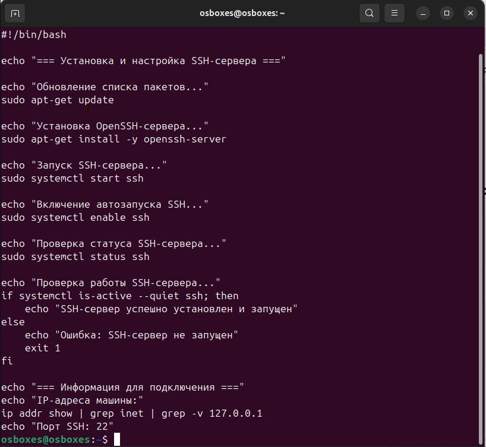
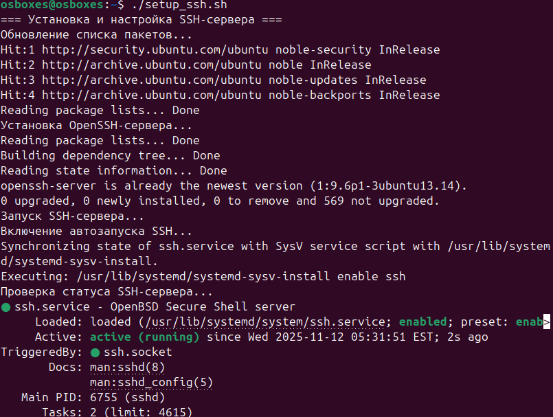
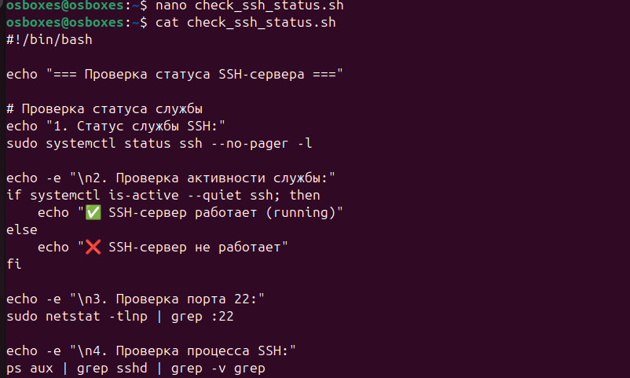
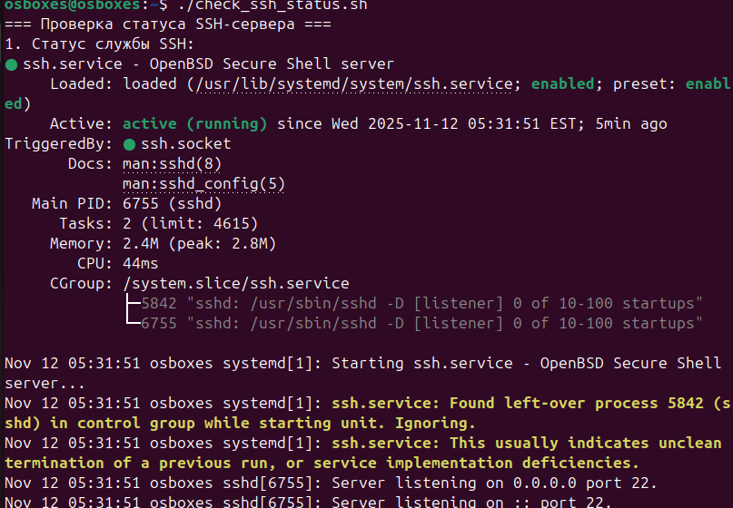

# Кейс 1: Установка и настройка SSH-сервера

## Последовательность действий

### 1. Создание скрипта установки SSH-сервера

```bash
nano setup_ssh.sh
```

Содержимое файла `setup_ssh.sh`:
```bash
#!/bin/bash

echo "=== Установка и настройка SSH-сервера ==="

echo "Обновление списка пакетов..."
sudo apt-get update

echo "Установка OpenSSH-сервера..."
sudo apt-get install -y openssh-server

echo "Запуск SSH-сервера..."
sudo systemctl start ssh

echo "Включение автозапуска SSH..."
sudo systemctl enable ssh

# Проверка статуса
echo "Проверка статуса SSH-сервера..."
sudo systemctl status ssh

echo "Проверка работы SSH-сервера..."
if systemctl is-active --quiet ssh; then
    echo "SSH-сервер успешно установлен и запущен"
else
    echo "Ошибка: SSH-сервер не запущен"
    exit 1
fi

echo "=== Информация для подключения ==="
echo "IP-адреса машины:"
ip addr show | grep inet | grep -v 127.0.0.1
echo "Порт SSH: 22"
```


На слудующем сриншоте можно увидеть, как идет процесс установки



### 2. Создание скрипта проверки статуса

```bash
nano check_ssh_status.sh
```

Содержимое файла `check_ssh_status.sh`:
```bash
#!/bin/bash

echo "=== Проверка статуса SSH-сервера ==="

# Проверка статуса службы
echo "1. Статус службы SSH:"
sudo systemctl status ssh --no-pager -l

echo -e "\n2. Проверка активности службы:"
if systemctl is-active --quiet ssh; then
    echo "✅ SSH-сервер работает (running)"
else
    echo "❌ SSH-сервер не работает"
fi

echo -e "\n3. Проверка порта 22:"
sudo netstat -tlnp | grep :22

echo -e "\n4. Проверка процесса SSH:"
ps aux | grep sshd | grep -v grep
```


Ниже можно увидеть скриншот результатов проверки 



### 3. Назначение прав на выполнение

```bash
chmod +x setup_ssh.sh check_ssh_status.sh
```

### 4. Запуск установки SSH-сервера

```bash
./setup_ssh.sh
```

### 5. Проверка статуса SSH-сервера

```bash
./check_ssh_status.sh
```


