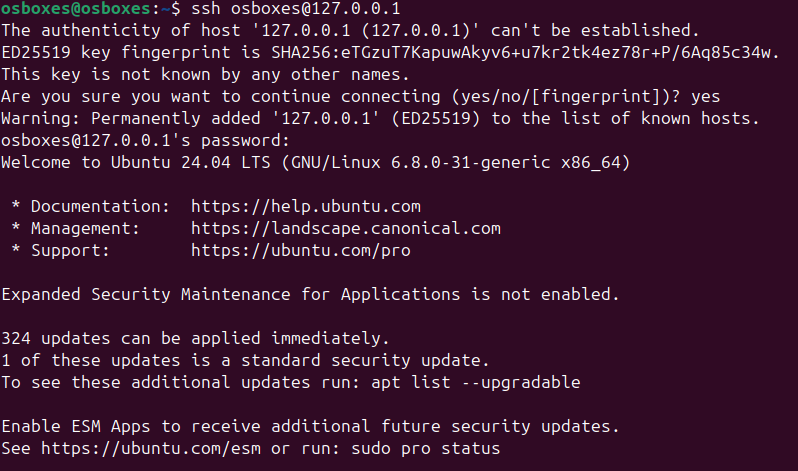
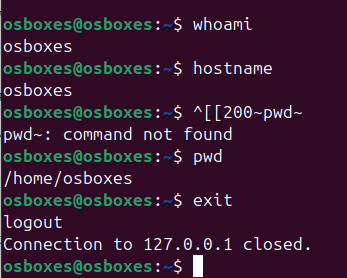

# Кейс 2: Подключение к удаленному серверу через SSH

## Описание задания
Подключение к удаленному серверу с использованием SSH клиента.

## Требования к результату
- Успешное подключение к удаленному серверу через SSH
- Подтверждена работа удаленной сессии

## Выполнение задания

### 1. Подключение к серверу

Выполняем команду подключения по SSH:

```bash
ssh osboxes@127.0.0.1
```



*На скриншоте видно успешное подключение к серверу*

### 2. Выполнение команд в SSH-сессии

После подключения выполняем команды для подтверждения работы в удаленной сессии:

```bash
whoami    # Показывает текущего пользователя
hostname  # Показывает имя хоста
pwd       # Показывает текущую директорию
```

### 3. Выход из сессии

Завершаем SSH-сессию:

```bash
exit
```



*На скриншоте видно выполнение команд в удаленной сессии*

*На скриншоте видно успешный выход из сессии*

## Результат выполнения

### Проверки пройдены:

1. **Успешное подключение по SSH** - установлено соединение с сервером
2. **Работа в удаленной сессии** - команды `whoami`, `hostname`, `pwd` выполняются на удаленном сервере
3. **Корректное завершение** - возможность выйти из сессии командой `exit`

### Вывод команд в сессии:
- `whoami` → `osboxes`
- `hostname` → `osboxes`
- `pwd` → `/home/osboxes`