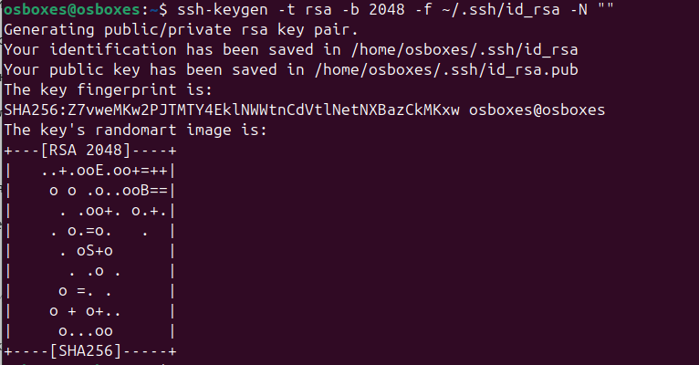
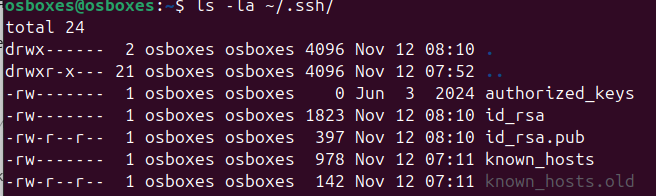
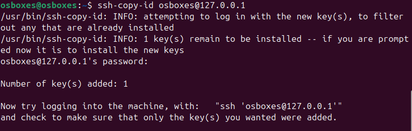
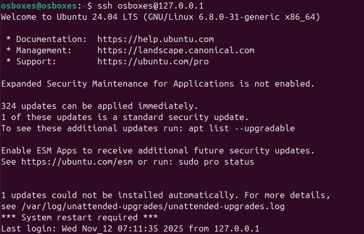

# Кейс 4: Работа с ключами SSH

## Описание задания
Генерация SSH ключей и настройка безпарольного доступа к серверу.

## Требования к результату
- Пара ключей SSH сгенерирована
- Публичный ключ добавлен на удаленный сервер  
- Успешное подключение к серверу без ввода пароля

## Выполнение задания

### 1. Генерация пары SSH ключей

```bash
ssh-keygen -t rsa -b 2048 -f ~/.ssh/id_rsa -N ""
```



### 2. Проверка созданных ключей

```bash
ls -la ~/.ssh/
```



### 3. Копирование публичного ключа на сервер

```bash
ssh-copy-id osboxes@127.0.0.1
```



### 4. Подключение к серверу без пароля

```bash
ssh osboxes@127.0.0.1
```



### 5. Выход из сессии

```bash
exit
```

